# ETrade — Full Stack E-Ticaret Platformu

Modern, rol tabanlı bir e-ticaret platformu. ASP.NET Core Web API backend ve Next.js frontend ile geliştirilmiştir.

---

## Ekran Görüntüleri

### Ana Sayfa — Kategori Filtreleme
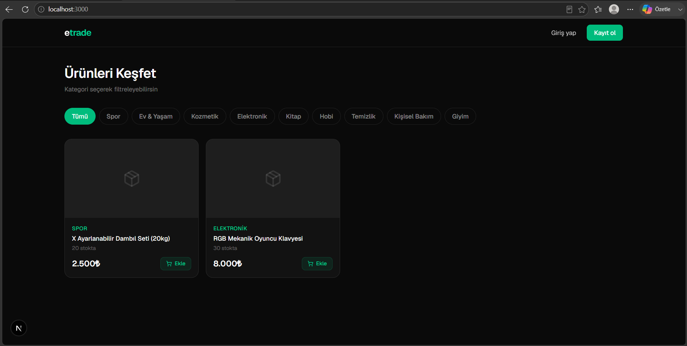

### Giriş Yap
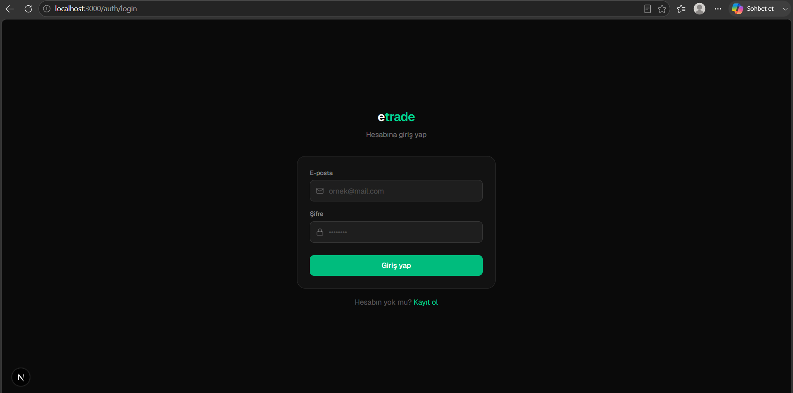

### Kayıt Ol
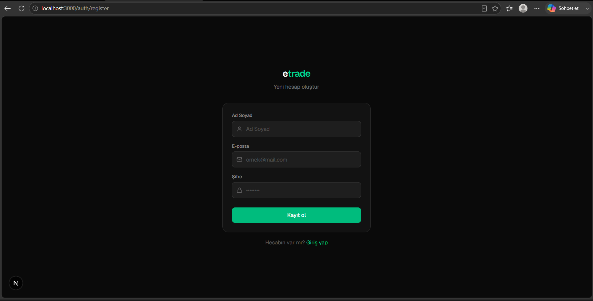

### Admin Panel — Dashboard
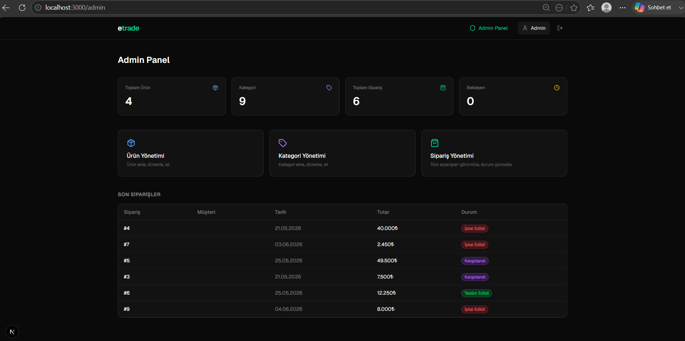

### Admin — Ürün Yönetimi (Soft Delete)
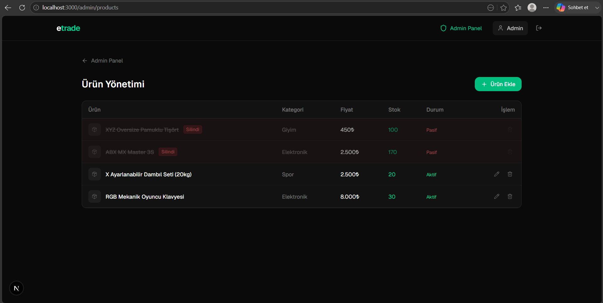

### Admin — Ürün Düzenleme
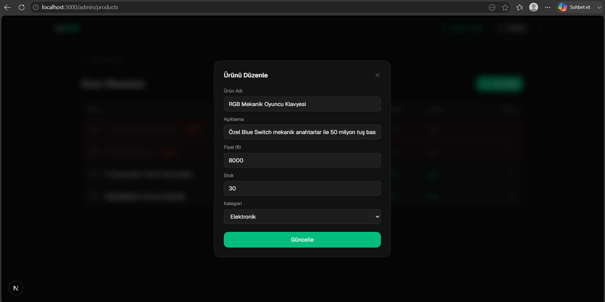

### Admin — Kategori Yönetimi
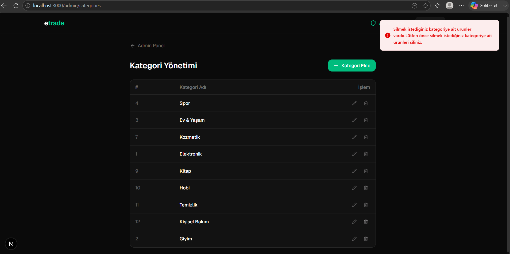

### Admin — Sipariş Yönetimi
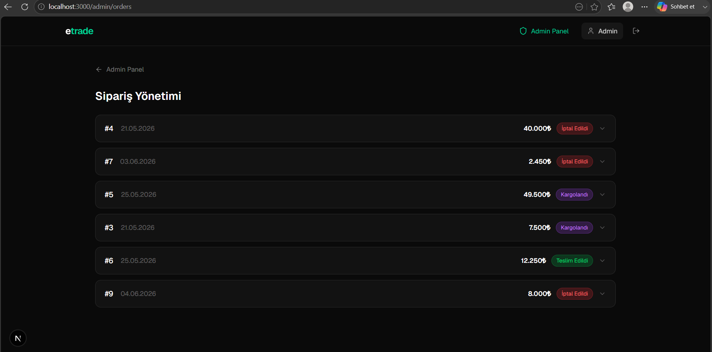

### Admin — Sipariş Durum Güncelleme
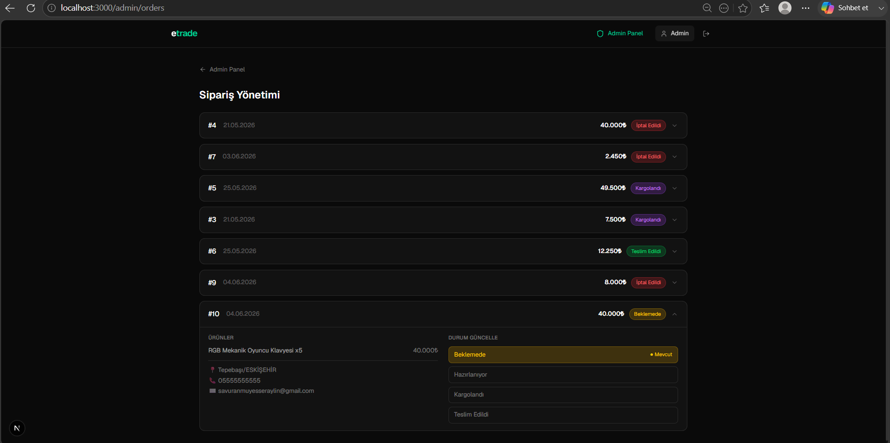

### Müşteri — Ürün Listesi (Giriş Sonrası)
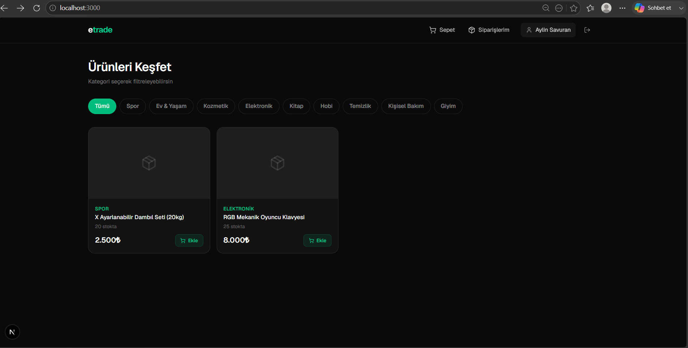

### Müşteri — Ürün Detayı
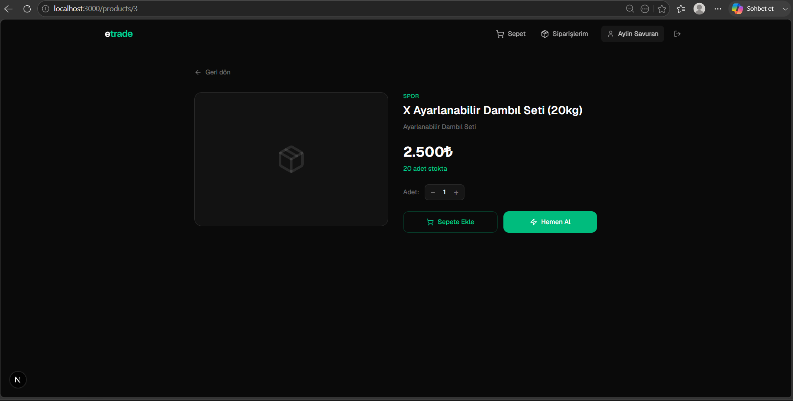

### Müşteri — Hemen Al
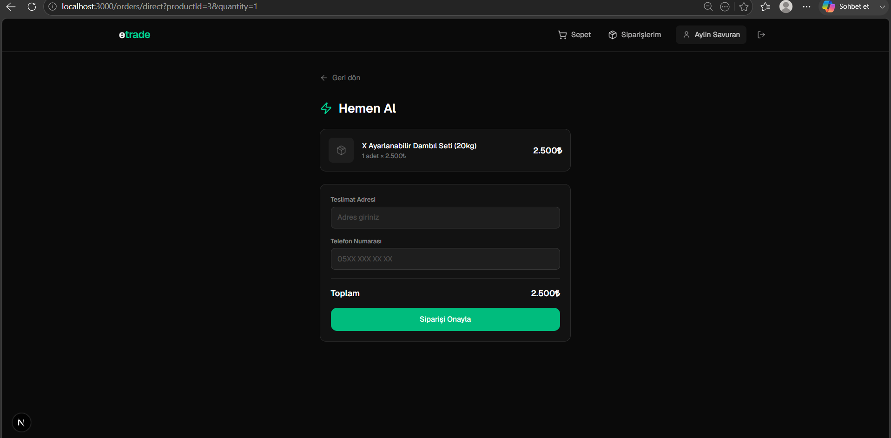

### Müşteri — Sepet
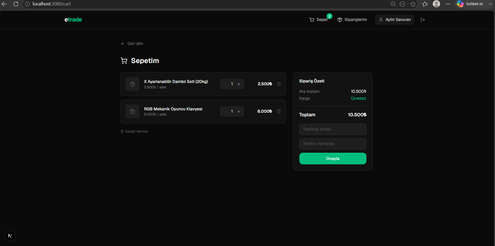

### Müşteri — Siparişlerim
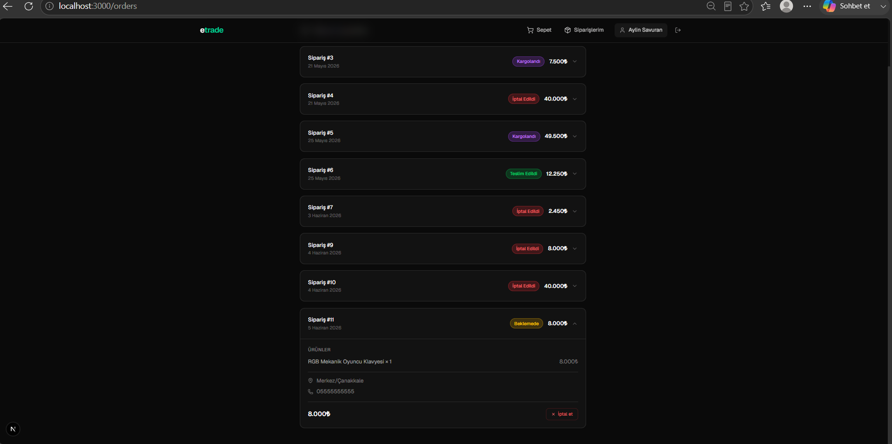

---

## Özellikler

### Müşteri
- Kategoriye göre ürün filtreleme
- Ürün detay sayfası
- Sepete ürün ekleme, adet güncelleme, silme
- Sepetten sipariş oluşturma
- Ürün sayfasından direkt sipariş (Hemen Al)
- Siparişleri listeleme ve detay görüntüleme
- Beklemedeki / hazırlanıyor aşamasındaki siparişi iptal etme
- Giriş yapılmadan sepet ve sipariş işlemleri engellenip login'e yönlendirme

### Admin
- Ürün ekleme, düzenleme, soft delete (silinmiş ürünler pasif olarak listelenir)
- Kategori ekleme, düzenleme, silme (ürünlü kategori silinemez, hata mesajı gösterilir)
- Tüm siparişleri listeleme, detay görüntüleme
- Sipariş durumu güncelleme (Beklemede → Hazırlanıyor → Kargolandı → Teslim Edildi)
- İptal edilen ve teslim edilen siparişlerin durumu değiştirilemez
- Sipariş oluşturulunca / durum değişince müşteriye otomatik e-posta gönderimi

---

## Teknoloji Stack

### Backend
| Teknoloji | Kullanım |
|---|---|
| ASP.NET Core 8 Web API | REST API |
| Entity Framework Core | ORM |
| PostgreSQL | Veritabanı |
| JWT Bearer | Kimlik doğrulama |
| AutoMapper | DTO mapping |
| MailKit | E-posta servisi |

### Frontend
| Teknoloji | Kullanım |
|---|---|
| Next.js 15 (App Router) | Framework |
| TypeScript | Tip güvenliği |
| Tailwind CSS | Stil |
| Axios | HTTP client |
| Zustand | Global state (auth) |
| TanStack React Query | Server state & cache |
| Sonner | Toast bildirimleri |
| Lucide React | İkonlar |

---

## Mimari

```
ETrade/
├── backend/
│   ├── ETrade.API          # Controllers, Middlewares, Migrations, Program.cs
│   ├── ETrade.Core         # Entities, DTOs, Services, Repositories, Data, Exceptions, Mapper, Helpers
└── frontend/
    └── src/
        ├── app/            # Next.js App Router sayfaları
        │   ├── auth/       # Login, Register
        │   ├── products/   # Ürün listesi, detay
        │   ├── cart/       # Sepet
        │   ├── orders/     # Siparişler, Hemen Al
        │   └── admin/      # Admin paneli
        ├── components/     # Navbar, Providers
        ├── hooks/          # useProducts, useCart, useOrders, useAuth...
        ├── store/          # Zustand auth store
        ├── lib/            # Axios instance
        └── types/          # TypeScript tipleri
```

---

## Kurulum

### Gereksinimler
- .NET 8 SDK
- Node.js 20+
- PostgreSQL

### Backend

```bash
# appsettings.json içindeki bağlantı dizesini düzenle
# DefaultConnection: PostgreSQL bağlantı bilgilerin

cd backend/ETrade.API
dotnet restore
dotnet ef database update
dotnet run
# API: https://localhost:7431
```

### Frontend

```bash
cd frontend
npm install
npm run dev
# http://localhost:3000
```

### Ortam Değişkenleri

Frontend `.env.local` dosyası oluştur:

```env
NEXT_PUBLIC_API_URL=https://localhost:7431/api
```

---

## API Endpoint'leri

| Method | Endpoint | Yetki | Açıklama |
|---|---|---|---|
| POST | /api/auth/register | Herkese açık | Kayıt ol |
| POST | /api/auth/login | Herkese açık | Giriş yap |
| GET | /api/product | Herkese açık | Ürünleri listele |
| GET | /api/product/{id} | Herkese açık | Ürün detayı |
| POST | /api/product | Admin | Ürün ekle |
| PUT | /api/product/{id} | Admin | Ürün güncelle |
| DELETE | /api/product/{id} | Admin | Ürün sil (soft delete) |
| GET | /api/category | Herkese açık | Kategorileri listele |
| POST | /api/category | Admin | Kategori ekle |
| PUT | /api/category/{id} | Admin | Kategori güncelle |
| DELETE | /api/category/{id} | Admin | Kategori sil |
| GET | /api/cart | Customer | Sepeti getir |
| POST | /api/cart | Customer | Sepete ürün ekle |
| PATCH | /api/cart/{id} | Customer | Sepet ürün adeti güncelle |
| DELETE | /api/cart/{id} | Customer | Sepetten ürün sil |
| DELETE | /api/cart | Customer | Sepeti temizle |
| GET | /api/order | Customer/Admin | Siparişleri listele |
| GET | /api/order/{id} | Customer/Admin | Sipariş detayı |
| POST | /api/order | Customer | Sepetten sipariş oluştur |
| POST | /api/order/direct | Customer | Direkt sipariş oluştur |
| PATCH | /api/order/{id}/cancel | Customer | Siparişi iptal et |
| PATCH | /api/order/{id}/status | Admin | Sipariş durumu güncelle |

---

## Roller

**Admin:** Ürün/kategori/sipariş yönetimi. Sepet ve müşteri sipariş işlemleri yapamaz.

**Customer:** Ürün görüntüleme, sepet, sipariş oluşturma ve iptal etme.
